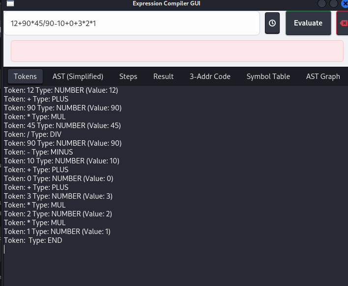
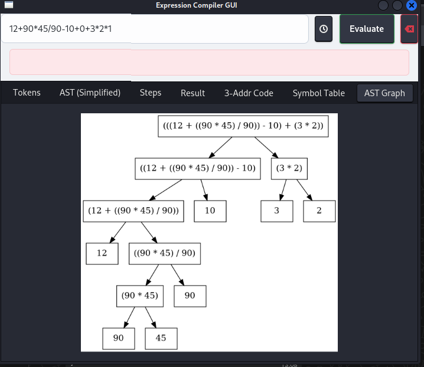
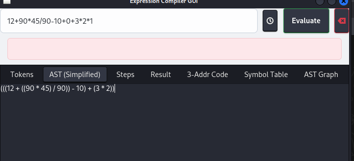
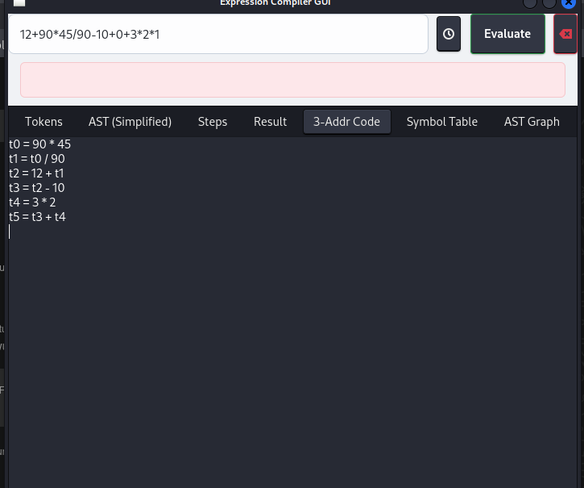
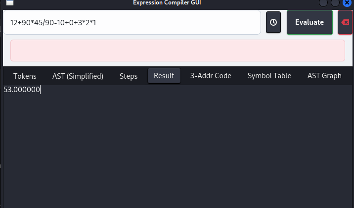

# 💻 Expression Compiler GUI (C++ with GTKmm)

A modern, GUI-based **arithmetic expression compiler** built in **C++** using **GTKmm 4**. This project covers all major phases of a compiler: **lexical analysis**, **parsing**, **simplification**, **evaluation**, **three-address code (TAC)** generation, and **AST (Abstract Syntax Tree)** visualization using **Graphviz**.

---

## ✨ Features

- ➕ **Arithmetic Operators**: `+`, `-`, `*`, `/`, `^`
- 🧠 **Logical Operators**: `==`, `!=`, `<`, `<=`, `>`, `>=`, `&&`, `||`, `!`
- 🧮 **Math Functions**:  
  `sin`, `cos`, `tan`, `sqrt`, `log`, `log10`, `exp`, `abs`, `floor`, `ceil`, `pow`, `min`, `max`
- 📝 **Variable Assignment**: Supports `x = 5` style syntax
- 🔍 **Step-by-Step Evaluation**: Detailed trace of evaluation
- 🧹 **AST Simplification**: Uses algebraic identities for optimization
- 🧾 **Three-Address Code (TAC)**: Intermediate code generation
- 🌳 **Graphical AST Generation**: Using Graphviz
- 📜 **Expression History**: View previously evaluated inputs
- 🪟 **Modern GUI**: Clean tabbed interface using GTKmm 4

---

## 🖼️ Screenshots

### 🔹 Tokenization


### 🔹 AST Graph (Graphviz)


### 🔹 AST Tree View


### 🔹 TAC and Output Result



---

## 🛠️ Installation & Usage

### 🐧 Linux

#### ✅ Step 1: Install Required Packages
```bash
sudo apt install g++ libgtkmm-4.0-dev graphviz
```

#### ⚙️ Step 2: Build the Code
```bash
g++ 2.cpp -o 2 `pkg-config gtkmm-4.0 --cflags --libs`
```

#### 🚀 Step 3: Run the Application
```bash
./2
```

---

### 🪟 Windows (via MSYS2)

#### ✅ Step 1: Install Dependencies
```bash
pacman -S mingw-w64-x86_64-gcc \
           mingw-w64-x86_64-pkg-config \
           mingw-w64-x86_64-gtkmm4 \
           mingw-w64-x86_64-graphviz
```

#### 📁 Step 2: Navigate to Project Folder
```bash
cd /path/to/project
```

#### ⚙️ Step 3: Build the Code
```bash
g++ 2.cpp -o 2 `pkg-config gtkmm-4.0 --cflags --libs`
```

#### 🚀 Step 4: Run the Application
```bash
./2
```

---

## 📂 Project Structure

| File/Folder           | Description                                  |
|-----------------------|----------------------------------------------|
| `2.cpp`               | Main application logic and GUI code          |
| `ast_simplified.dot`  | AST in DOT format (auto-generated)           |
| `ast_simplified.png`  | AST image generated via Graphviz             |

---

## 🧪 How to Use the Application

1. 🔢 Enter an expression in the input box.
2. 🧠 Click **Evaluate** to process:
   - Tokens
   - Simplified AST
   - Step-by-step evaluation
   - Final result
   - TAC
   - Symbol table
   - AST Graph
3. 🔁 Click **Clear Symbols** to reset symbol table.
4. 📜 Click **History** to view previously entered expressions.

---

## ⚠️ Notes

- AST graph generation requires **Graphviz** to be installed and accessible via system path.
- Ensure your GTKmm version is **4.0** or higher.
- Project tested on:
  - Ubuntu 22.04
  - Windows 10 with MSYS2

---

## 👨‍💻 Authors

> 🧑‍💻 Utkarsh Kushwaha
> 🧑‍💻 Dev Kumar Prajapati
> 🧑‍💻 Rohit Pant
> 🧑‍💻 Rahul Dev Kumar
> 🎓 B.Tech (CSE) Project

